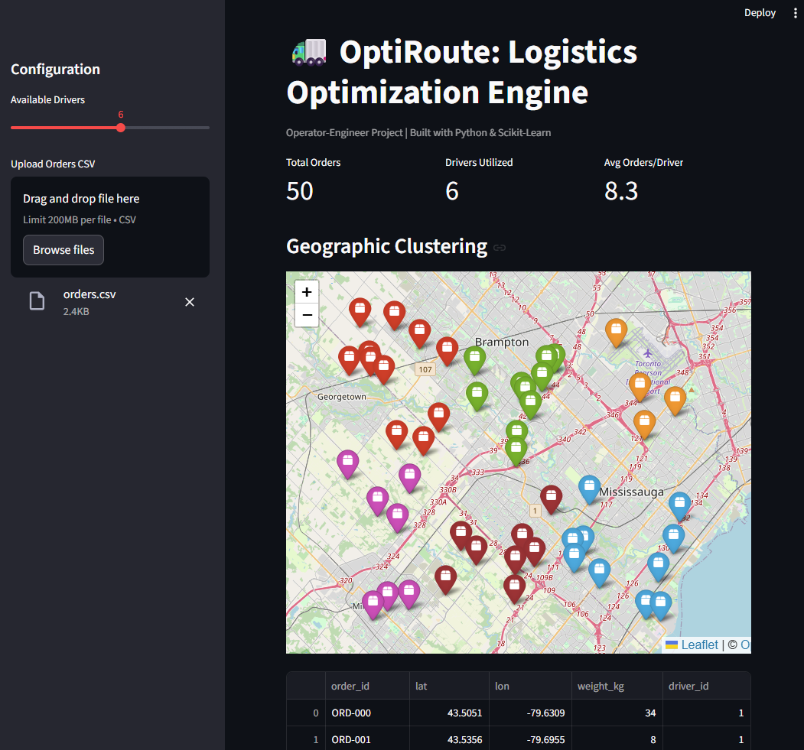

# Optiroute 🚚

**A high-performance route optimization engine and visualization dashboard designed for last-mile delivery efficiency.**

Optiroute bridges the gap between raw logistics data and actionable operational insights. It uses a FastAPI backend to process delivery nodes and a Streamlit dashboard to visualize optimized routing clusters, aiming to reduce driver idle time and improve delivery density.

 

## 💡 The "Why"
Logistics operations often suffer from inefficient route planning, leading to increased fuel costs and missed Service Level Agreements (SLAs). Drawing from experience in high-volume operations (e.g., Amazon Logistics), Optiroute was built to demonstrate how modern Python stacks can solve:
* **Inefficient Clustering:** Grouping deliveries geographically to minimize "windshield time."
* **Data Visibility:** transforming rows of address data into an interactive map for dispatchers.
* **Scalability:** Using containerization to ensure the tool runs reliably in any environment.

## 🚀 Key Features
* **Algorithmic Routing Logic:** Backend logic designed to ingest coordinate data and propose optimized groupings.
* **Interactive Operations Dashboard:** A Streamlit interface allows dispatchers to upload manifests and visualize routes in real-time.
* **API-First Architecture:** Built on FastAPI with auto-generated Swagger documentation, allowing for easy integration with existing TMS (Transport Management Systems).
* **Containerized Deployment:** Fully Dockerized environment ensures consistency from development to production.

## 🛠️ Tech Stack
* **Core Logic:** Python 3.11+
* **Backend API:** FastAPI (High-performance async framework)
* **Visualization:** Streamlit (Data dashboarding)
* **Infrastructure:** Docker & Docker Compose

## 📦 Installation & Usage (Docker Method)

The recommended way to run the project is using Docker Compose to spin up the isolated environment.

1.  **Clone the repository:**
    ```bash
    git clone [https://github.com/musa-kal/optiroute.git](https://github.com/musa-kal/optiroute.git)
    cd optiroute
    ```

2.  **Run the application:**
    ```bash
    docker-compose up --build
    ```

3.  **Access the Services:**
    * **Dashboard:** [http://localhost:8501](http://localhost:8501)
    * **API Docs:** [http://localhost:8000/docs](http://localhost:8000/docs)

4.  **Stop the application:**
    Press `Ctrl+C` in the terminal, or run:
    ```bash
    docker-compose down
    ```

## 📦 Installation (Manual Method)

If you prefer to run it locally without Docker:

1.  **Backend:**
    ```bash
    cd backend
    pip install -r requirements.txt
    uvicorn main:app --reload
    ```
2.  **Frontend:**
    ```bash
    cd frontend
    pip install -r requirements.txt
    streamlit run dashboard.py
    ```

## 🔮 Future Roadmap
* Integration with open-source map tiles (OpenStreetMap) for turn-by-turn visualization.
* Implementation of VRP (Vehicle Routing Problem) solvers/heuristics for advanced constraint handling (time windows, vehicle capacity).
* Authentication layer for multi-tenant dispatcher use.

## 📄 License
This project is licensed under the MIT License.